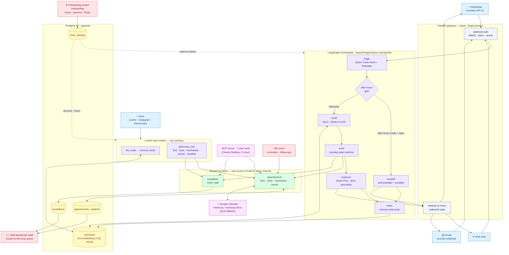

> **中文摘要** · 面向诊所的多渠道自主前台 AI 助手。同一套智能体覆盖 **WhatsApp、网页、语音电话、电子邮件** 四个渠道,具备跨渠道患者记忆、严格的事实约束(不编造)、以及营业时间外自动接待模式。基于 **Qwen-Plus + Qwen-Turbo + text-embedding-v3**(均通过 DashScope 调用)构建。Qwen Cloud 黑客松 Track 4 参赛作品。

# HealthDesk AI

A multi-channel autonomous front-desk agent for clinics. Patients reach it on **WhatsApp**, the **web**, or by **voice**, and the same brain answers across all three — with patient-specific memory carried across channels.

> Submission for the Qwen Cloud Hackathon (Track 4). See [`docs/PRD.md`](docs/PRD.md) and [`docs/TRD.md`](docs/TRD.md) for full product and technical specs.

---

## Why this is different

Most agent-demo submissions are *"ChatGPT with a webhook"* — stateless, generic, and confidently wrong about things they cannot know. HealthDesk pushes on three things:

1. **Patient-specific memory that survives sessions.** Recalled from pgvector on every turn, on every channel, with decay-aware re-ranking. The agent volunteers context the patient never mentioned in the current message ("I see you prefer afternoons after 3pm").
2. **Strict grounding.** It refuses to invent clinic-specific facts — hours, prices, doctors, insurance — and offers to check with staff instead. *"I don't know"* is a feature.
3. **Channel parity.** WhatsApp, web, and voice all use the same memory layer and the same tool implementations. Voice is not a stripped-down sibling; it has full feature parity via LiveKit's `llm_node` hook + `@function_tool` decorators.

---

## Architecture at a glance



> Static render for slides/print: [`docs/architecture.png`](docs/architecture.png).
>
> **Legend:** 🟦 channels · ⬜ gateway · 🟪 agent brain (text graph + voice worker) · 🟩 shared tool layer · 🟨 Postgres/pgvector · 🟥 ops surfaces (`/staff`, `/onboarding`, n8n) · 🟧 external (MCP, Google Calendar).

The shape of the system is the headline: **four channels and an MCP server all funnel into one shared tool layer**, so booking / reschedule / cancel / escalation behave identically everywhere and write once to Postgres (the source of truth) while mirroring to Google Calendar. Decay-weighted pgvector memory feeds both the text graph and the voice worker; clinic config set in the onboarding wizard is read live by both.

| Layer | Tech |
|---|---|
| Reasoning | Qwen-Plus via DashScope (OpenAI-compatible) |
| Intent routing | Qwen-Turbo (cheap classifier) |
| Memory | Qwen `text-embedding-v3` @ 1024d, pgvector ivfflat cosine, decay-weighted re-rank |
| Orchestration | LangGraph 1.x with AsyncPostgresSaver checkpointing |
| Voice STT | Deepgram Nova-3 |
| Voice TTS | ElevenLabs Flash v2.5 |
| Voice runtime | LiveKit Agents 1.5 |
| WhatsApp transport | Evolution API v2 (`evoapicloud/evolution-api`) |
| Email transport | Provider webhook + send (Postmark-shaped, swappable) |
| Calendar | Google Calendar v3 — free/busy + booking mirror; local fallback |
| Clinic config | Self-serve onboarding wizard → `clinic_settings`, read at runtime |
| External tool access | MCP server (7 clinic tools, any MCP client) |
| Background jobs | n8n (reminders, follow-ups) |
| Persistence | Postgres 16 + pgvector |

---

## Quick start

### Prerequisites

- Docker Desktop (for Postgres + pgvector + n8n)
- Python 3.12 (the pinned deps don't yet have wheels for 3.14)
- A Qwen API key from Alibaba Model Studio (international console)
- For voice: a LiveKit Cloud project + Deepgram + ElevenLabs API keys
- For WhatsApp: an Evolution API v2 instance (e.g. deployed on Railway with `evoapicloud/evolution-api:latest`)

### Bring up the stack

```bash
# 1. Copy and fill the environment file
cp .env.example .env
# At minimum: DASHSCOPE_API_KEY, QWEN_API_BASE
# For full demo: + DATABASE_URL, EVOLUTION_*, LIVEKIT_*, DEEPGRAM_*, ELEVENLABS_*

# 2. Bring up Postgres on host port 5433 (avoids collisions with a native install)
docker compose up -d postgres

# 3. Seed three demo patients with memories embedded against Qwen
python -m evals.seed_demo

# 4. Start the FastAPI gateway (WhatsApp + web)
uvicorn app.main:app --reload

# 5. (Optional) Start the voice worker against LiveKit Cloud
python -m app.voice.agent_worker dev
```

### Smoke tests

```bash
# Health
curl localhost:8000/health

# Web webhook — try a memory-triggering query against a seeded patient
curl -X POST localhost:8000/webhooks/web \
  -H 'content-type: application/json' \
  -d '{"session_id":"smoke","patient_id":"<adaeze-uuid>","content":"Can I book later in the day?"}'
# Expect: reply that mentions afternoon preference unprompted

# Intent eval (30 cases, hits real Qwen)
python -m evals.run_intent_eval

# Full test suite — 111 cases, no Qwen/LiveKit/Postgres required
pytest
```

---

## Repo layout

```
app/
  main.py                  FastAPI entrypoint + lifespan
  config.py                Pydantic Settings
  gateway/
    schema.py              PatientMessage / PatientReply
    cache.py               TLRUCache session cache
    redact.py              Outbound secret redaction
    adapters/
      whatsapp.py          Evolution v2 webhook (HMAC / token / apikey)
      web.py               Browser webhook
      evolution_client.py  Outbound send-text client
  agents/
    orchestrator.py        LangGraph wiring + AsyncPostgresSaver
    triage.py              Qwen-Turbo intent classifier
    recall.py              Memory recall node
    tools_node.py          Dispatches to app.tools.*
    reasoner.py            Qwen-Plus reply synthesis (strict grounding)
    writer.py              Fire-and-forget memory write-back
    qwen_client.py         OpenAI-compatible DashScope client
    state.py               Shared LangGraph AgentState
  memory/
    db.py                  asyncpg pool
    score.py               decay-aware ranking
    recall.py              top-k×2 + re-rank pipeline
    write.py               summarise + insert + embed
    profile.py             patient profile resolve/upsert
  tools/
    appointments.py        slot suggestions, booking, lookup
    escalation.py          Slack webhook + dashboard queue insert
  dashboard/
    router.py              /staff human-in-the-loop console (HTMX + SSE)
    store.py               escalation queue persistence + staff actions
    events.py              in-process pub/sub for live updates
    templates/index.html   single-page staff console
  chat/
    router.py              /chat patient-facing widget (light theme)
    templates/index.html   self-contained chat UI -> /webhooks/web
  mcp/
    server.py              FastMCP stdio server — clinic tools for MCP clients
  voice/
    agent_worker.py        LiveKit Agents 1.x worker w/ full parity:
                           - llm_node override → memory recall
                           - @function_tool methods (find/book/escalate)
                           - on_exit → session memory write-back
supabase/migrations/
  0001_init.sql            pgvector(1024), patients, memories, appointments
n8n/
  reminder_cron.json       hourly appointment reminders
  followup_cron.json       6-hourly post-visit follow-ups
evals/
  intent_cases.jsonl       30 labelled intent classification cases
  run_intent_eval.py       eval harness (accuracy + latency percentiles)
  results/
    intent_eval_results.json  committed output of the last eval run
  memory_recall_cases.json 10 scripted recall scenarios
  seed_demo.py             3 demo patients × 8 memories (embedded via Qwen)
deploy/
  supervisord.conf         gateway + voice supervisor (for single-container deploy)
tests/                     111 cases, all green
Dockerfile                 supervisord-based image (FastAPI + voice worker)
docker-compose.yml         app + postgres(pgvector) + n8n
```

---

## MCP server

The same clinic tools the agent uses are exposed over the [Model Context
Protocol](https://modelcontextprotocol.io), so any MCP client — Claude
Desktop, Cursor, etc. — can work the front desk without touching the web UI.
This is aimed at **staff/admin "copilot" use** (ask an LLM client to check the
schedule, move a booking, page a nurse), not at patients — patients stay on
voice / WhatsApp / email.

| Tool | Does |
|---|---|
| `suggest_slots` | next open slots within business hours (calendar free/busy aware) |
| `lookup_patient` | resolve a patient profile by phone |
| `book_appointment` | book a confirmed slot (double-booking guarded) |
| `reschedule_appointment` | move a booking atomically (slot-taken safe) |
| `cancel_appointment` | cancel a booking (patient-scoped) |
| `get_appointment_history` | upcoming + past appointments |
| `escalate_to_staff` | page staff; lands in the `/staff` dashboard queue |

Claude Desktop config (`claude_desktop_config.json`):

```json
{
  "mcpServers": {
    "healthdesk": {
      "command": "<repo>/.venv/Scripts/python.exe",
      "args": ["-m", "app.mcp.server"],
      "env": { "PYTHONPATH": "<repo>" }
    }
  }
}
```

The server reads the same `.env` as the gateway; it needs `DATABASE_URL`
(and Postgres up) to answer.

---

## Eval results

Measured against live Qwen via DashScope on 2026-06-12. Raw per-case output is committed at [`evals/results/intent_eval_results.json`](evals/results/intent_eval_results.json); reproduce with `python -m evals.run_intent_eval`.

| Component | Metric | Result |
|---|---|---|
| Qwen-Turbo intent classifier | Accuracy on 30 labelled cases (6 intents) | **100% (30/30)** |
| Triage round-trip latency | p50 / p95 | **882 ms / 5.6 s** |
| Test suite (no network required) | 111 unit/integration cases | **all green** |

The latency p95 is dominated by occasional slow responses from the DashScope international endpoint, not by anything in the pipeline — most calls complete in 700–950 ms.

---

## Demo data

`evals/seed_demo.py` creates three patients, each with realistic memories embedded via Qwen and inserted into pgvector:

| Patient | Phone | Memories |
|---|---|---|
| Adaeze Okafor | (mapped to demo number) | prefers afternoons after 3pm · allergic to penicillin · sprained ankle Apr 2026 |
| Tunde Adebayo | 2348023456789 | T2 diabetes (2024) · wife Ngozi books on his behalf · Cigna PPO |
| Chiamaka Eze | 2348034567890 | hearing-impaired, prefers WhatsApp · prefers female physicians |

When a patient messages or calls, the agent uses the recovered memories without being asked. *"Sure, Adaeze — and since you prefer afternoons, I can offer 3pm or 3:30pm tomorrow."*

---

## Current status

| Channel | Inbound | Outbound | Memory recall | Memory write-back | Tools |
|---|---|---|---|---|---|
| WhatsApp | live (Evolution v2) | live | ✅ | ✅ | ✅ |
| Web | live | live | ✅ | ✅ | ✅ |
| Voice | live (LiveKit Cloud) | live | ✅ | ✅ | ✅ |
| Email | live (provider webhook) | live (threaded reply) | ✅ (by email) | ✅ | ✅ |

| Capability | Status |
|---|---|
| Channel parity (voice · WhatsApp · web · email) | ✅ one orchestrator graph + shared tool layer across all four |
| After-hours mode | ✅ `ANSWER_MODE=after_hours` auto-handles only when closed; hands off to staff during open hours |
| Self-serve onboarding wizard (`/onboarding`) | ✅ set hours, working days, timezone, answer mode, persona & FAQs from a web form; agent applies them live (no restart) |
| Patient chat widget (`/chat`) | ✅ self-contained light-theme web UI that talks to the same orchestrator graph as every other channel |
| Real calendar backend (Google) | ✅ business-hours availability + free/busy + booking mirror; falls back to local scheduler when unconfigured |
| MCP server (7 clinic tools, any MCP client) | ✅ `python -m app.mcp.server` |
| Human-in-the-loop staff dashboard (`/staff`) | ✅ live escalation queue, approve/redirect/close |
| Multilingual replies (language auto-detected in triage) | ✅ text channels + voice STT code-switching |
| pgvector memory + decay re-rank | ✅ |
| Grounding rule against hallucinated facts | ✅ |
| Outbound secret redaction | ✅ |
| Test suite (111 cases) | ✅ |
| Intent classifier eval (30 labelled cases) | ✅ 100% |
| Voice filler-before-tool-call rule | ✅ |
| Evolution v2 webhook auth (HMAC/token/apikey) | ✅ |
| Slack escalation webhook | ✅ (endpoint ready, needs URL) |
| Multi-tenancy | ❌ (deferred post-hackathon) |
| Production HIPAA infrastructure | ❌ (descoped) |

---

## Notes on safety and scope

- **No real patient data.** Synthetic only. PHI handling is considered in the design but production HIPAA infrastructure is out of scope for the hackathon.
- **Secret redaction.** Every outbound reply passes through `gateway.redact.redact()` before reaching the platform.
- **Webhook auth.** WhatsApp webhooks support three auth modes (HMAC `X-Hub-Signature-256`, shared-secret token + IP allowlist, or Evolution v2's `apikey` header), switched via `EVOLUTION_AUTH_MODE`.
- **Voice as a flag.** Set `HEALTHDESK_VOICE=false` to disable the voice worker if LiveKit Cloud isn't available.
- **Caller identity in voice demos.** Browser-based voice uses `HEALTHDESK_DEMO_PATIENT_PHONE` to identify the caller (so recall demos work). SIP-driven sessions would use the real caller ID via room metadata.

---

## Author

**Otito Ogene** — Qwen Cloud Hackathon submission, June 2026.

## License

[MIT](LICENSE) © 2026 Otito Ogene
